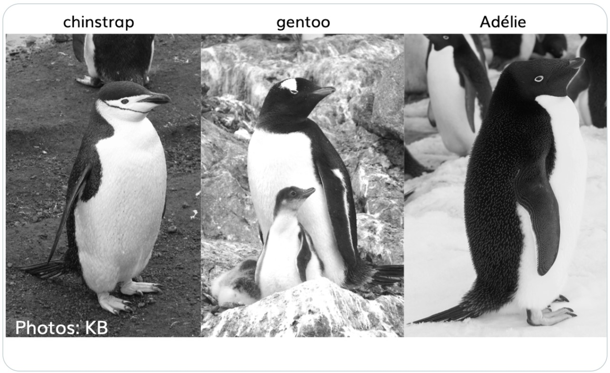

# 펭귄 데이터셋

## 펭귄 데이터 출현

미국에서 "George Floyd"가 경찰에 의해 살해되면서 촉발된 ["Black Lives
Matter"](https://ko.wikipedia.org/wiki/Black_Lives_Matter) 운동은
아프리카계 미국인을 향한 폭력과 제도적 인종주의에 반대하는 사회운동이다.
한국에서도 소수 정당인 정의당에서 [여당 의원 176명 중 누가?...차별금지법
발의할 '의인'을
구합니다](http://www.hani.co.kr/arti/politics/assembly/949422.html)로
기사로 낼 정도로 적극적으로 나서고 있다.

데이터 과학에서 최근 R.A. Fisher의 과거 저술한 "The genetical theory of
natural selection" [@fisher1958genetical] 우생학(Eugenics) 대한
관점이 논란이 되면서 R 데이터 과학의 첫
데이터셋으로 붓꽃 `iris` 데이터를 다른 데이터, 즉 펭귄 데이터로 대체하는
움직임이 활발히 전개되고 있다.
[`palmerpenguins`](https://github.com/allisonhorst/palmerpenguins)
[@penguin2020] 데이터셋이 대안으로 많은 호응을 얻고 있다.
[@AbdulMajedRaja2020, @Levy2019]

## 펭귄 공부 {#penguins-study}

팔머(Palmer) 펭귄은 3종이 있으며 자세한 내용은 다음 나무위키를 참조한다.
[^1]

[^1]: [신발끈 여행사,
    관광안내자료](http://www.shoestring.kr/shoecast/aaa/sp_01_peninsula/peninsula.html)

-   [젠투 펭귄(Gentoo Penguin)](https://namu.wiki/w/젠투펭귄): 머리에
    모자처럼 둘러져 있는 하얀 털 때문에 알아보기가 쉽다. 암컷이 회색이
    뒤에, 흰색이 앞에 있다. 펭귄들 중에 가장 빠른 시속 36km의 수영
    실력을 자랑하며, 짝짓기 할 준비가 된 펭귄은 75-90cm까지도 자란다.
-   [아델리 펭귄(Adelie Penguin)](https://namu.wiki/w/아델리펭귄):
    프랑스 탐험가인 뒤몽 뒤르빌(Dumont D'Urville) 부인의 이름을 따서
    '아델리'라 불리게 되었다. 각진 머리와 작은 부리 때문에 알아보기
    쉽고, 다른 펭귄들과 마찬가지로 암수가 비슷하게 생겼지만 암컷이 조금
    더 작다.
-   [턱끈 펭귄(Chinstrap Penguin)](https://namu.wiki/w/턱끈펭귄): 언뜻
    보면 아델리 펭귄과 매우 비슷하지만, 몸집이 조금 더 작고, 목에서 머리
    쪽으로 이어지는 검은 털이 눈에 띈다. 어린 고삐 펭귄들은 회갈색 빛을
    띄는 털을 가지고 있으며, 목 아래 부분은 더 하얗다. 무리를 지어
    살아가며 일부일처제를 지키기 때문에 짝짓기 이후에도 부부로써
    오랫동안 함께 살아간다.


::: {.cell}

```{.r .cell-code}
library(webshot2)

webshot(url="https://allisonhorst.github.io/palmerpenguins/", selector = "#meet-the-palmer-penguins > p > img", "images/penguin-species.png")
```
:::


다음으로 `iris` 데이터와 마찬가지로 펭귄 3종을 구분하기 위한 변수로
조류의 부리에 있는 중앙 세로선의 융기를 지칭하는 능선(`culmen`)
길이(culmen length)와 깊이(culmen depth)를 이해하면 된다.


::: {.cell}

```{.r .cell-code}
library(webshot)

webshot(url="https://allisonhorst.github.io/palmerpenguins/", selector = "#what-are-culmen-length--depth > p:nth-child(4) > img", "fig/penguin-species-variable.png")
```
:::


## 펭귄 서식지 {#penguin-home}

`leaflet` 팩키지로 펭귄 서식지를 남극에서 특정한다. `geocoding`을 해야
하는데 구글에서 위치 정보를 구글링하면 <https://latitude.to/>에서 직접
위경도를 반환하여 준다. 이 정보를 근거로 하여 펭귄 서식지를 시각화한다.

::: {#palmer layout="[[1,1], [1,1,1,1]]"}
{width="1284"}



{width="1074"}


{width="1074"}

{width="1074"}

파머 펭귄 데이터셋
:::


::: {.cell}

```{.r .cell-code}
library(tidyverse)
library(leaflet)
library(palmerpenguins)
# library(tidygeocoder)

penguins %>% 
  count(island)
```

::: {.cell-output .cell-output-stdout}
```
# A tibble: 3 × 2
  island        n
  <fct>     <int>
1 Biscoe      168
2 Dream       124
3 Torgersen    52
```
:::

```{.r .cell-code}
island_df <- tribble(~"address", ~"lat", ~"lng",
                     "Torgersen Island antarctica", -64.772819, -64.074325,
                     "Dream Island antarctica", -64.725558, -64.225562,
                     "Biscoe Island antarctica", -64.811565, -63.777947,
                     "Palmer Station", -64.774312, -64.054213)

island_df %>% 
  leaflet() %>% 
  addProviderTiles(providers$OpenStreetMap) %>% 
  addMarkers(lng=~lng, lat=~lat, 
                   popup = ~ as.character(paste0("<strong>", paste0("명칭:",`address`), "</strong><br>",
                                                 "-----------------------------------------------------------<br>",
                                                 "&middot; latitude: ", `lat`, "<br>",
                                                 "&middot; longitude: ", `lng`, "<br>"
                   ))) 
```

::: {.cell-output-display}
```{=html}
<div class="leaflet html-widget html-fill-item-overflow-hidden html-fill-item" id="htmlwidget-c2c4a183a7166426701f" style="width:100%;height:464px;"></div>
<script type="application/json" data-for="htmlwidget-c2c4a183a7166426701f">{"x":{"options":{"crs":{"crsClass":"L.CRS.EPSG3857","code":null,"proj4def":null,"projectedBounds":null,"options":{}}},"calls":[{"method":"addProviderTiles","args":["OpenStreetMap",null,null,{"errorTileUrl":"","noWrap":false,"detectRetina":false}]},{"method":"addMarkers","args":[[-64.772819,-64.725558,-64.811565,-64.774312],[-64.074325,-64.225562,-63.777947,-64.054213],null,null,null,{"interactive":true,"draggable":false,"keyboard":true,"title":"","alt":"","zIndexOffset":0,"opacity":1,"riseOnHover":false,"riseOffset":250},["<strong>명칭:Torgersen Island antarctica<\/strong><br>-----------------------------------------------------------<br>&middot; latitude: -64.772819<br>&middot; longitude: -64.074325<br>","<strong>명칭:Dream Island antarctica<\/strong><br>-----------------------------------------------------------<br>&middot; latitude: -64.725558<br>&middot; longitude: -64.225562<br>","<strong>명칭:Biscoe Island antarctica<\/strong><br>-----------------------------------------------------------<br>&middot; latitude: -64.811565<br>&middot; longitude: -63.777947<br>","<strong>명칭:Palmer Station<\/strong><br>-----------------------------------------------------------<br>&middot; latitude: -64.774312<br>&middot; longitude: -64.054213<br>"],null,null,null,null,{"interactive":false,"permanent":false,"direction":"auto","opacity":1,"offset":[0,0],"textsize":"10px","textOnly":false,"className":"","sticky":true},null]}],"limits":{"lat":[-64.811565,-64.725558],"lng":[-64.225562,-63.777947]}},"evals":[],"jsHooks":[]}</script>
```
:::
:::


## 데이터 설치

`remotes` 팩키지 `install_github()` 함수로 펭귄 데이터를 설치한다.


::: {.cell}

```{.r .cell-code}
# install.packages("remotes")
remotes::install_github("allisonhorst/palmerpenguins")
```
:::


`tidyverse` 팩키지 `glimpse()` 함수로 펭귄 데이터를 일별한다.


::: {.cell}

```{.r .cell-code}
library(tidyverse)
library(palmerpenguins)

glimpse(penguins)
```

::: {.cell-output .cell-output-stdout}
```
Rows: 344
Columns: 8
$ species           <fct> Adelie, Adelie, Adelie, Adelie, Adelie, Adelie, Adel…
$ island            <fct> Torgersen, Torgersen, Torgersen, Torgersen, Torgerse…
$ bill_length_mm    <dbl> 39.1, 39.5, 40.3, NA, 36.7, 39.3, 38.9, 39.2, 34.1, …
$ bill_depth_mm     <dbl> 18.7, 17.4, 18.0, NA, 19.3, 20.6, 17.8, 19.6, 18.1, …
$ flipper_length_mm <int> 181, 186, 195, NA, 193, 190, 181, 195, 193, 190, 186…
$ body_mass_g       <int> 3750, 3800, 3250, NA, 3450, 3650, 3625, 4675, 3475, …
$ sex               <fct> male, female, female, NA, female, male, female, male…
$ year              <int> 2007, 2007, 2007, 2007, 2007, 2007, 2007, 2007, 2007…
```
:::
:::


## 자료구조 일별 {#penguin-EDA-skimr}

`skimr` 팩키지를 사용해서 `penguins` 데이터프레임 자료구조를 일별한다.
이를 통해서 344개 펭귄 관측값이 있으며, 7개 칼럼으로 구성된 것을 확인할
수 있다. 또한, 범주형 변수가 3개, 숫자형 변수가 4개로 구성되어 있다.
그외 더 자세한 사항은 범주형, 숫자형 변수에 대한 요약 통계량을 참조한다.


::: {.cell}

```{.r .cell-code}
skimr::skim(penguins)
```

::: {.cell-output-display}
Table: Data summary

|                         |         |
|:------------------------|:--------|
|Name                     |penguins |
|Number of rows           |344      |
|Number of columns        |8        |
|_______________________  |         |
|Column type frequency:   |         |
|factor                   |3        |
|numeric                  |5        |
|________________________ |         |
|Group variables          |None     |


**Variable type: factor**

|skim_variable | n_missing| complete_rate|ordered | n_unique|top_counts                  |
|:-------------|---------:|-------------:|:-------|--------:|:---------------------------|
|species       |         0|          1.00|FALSE   |        3|Ade: 152, Gen: 124, Chi: 68 |
|island        |         0|          1.00|FALSE   |        3|Bis: 168, Dre: 124, Tor: 52 |
|sex           |        11|          0.97|FALSE   |        2|mal: 168, fem: 165          |


**Variable type: numeric**

|skim_variable     | n_missing| complete_rate|    mean|     sd|     p0|     p25|     p50|    p75|   p100|hist  |
|:-----------------|---------:|-------------:|-------:|------:|------:|-------:|-------:|------:|------:|:-----|
|bill_length_mm    |         2|          0.99|   43.92|   5.46|   32.1|   39.23|   44.45|   48.5|   59.6|▃▇▇▆▁ |
|bill_depth_mm     |         2|          0.99|   17.15|   1.97|   13.1|   15.60|   17.30|   18.7|   21.5|▅▅▇▇▂ |
|flipper_length_mm |         2|          0.99|  200.92|  14.06|  172.0|  190.00|  197.00|  213.0|  231.0|▂▇▃▅▂ |
|body_mass_g       |         2|          0.99| 4201.75| 801.95| 2700.0| 3550.00| 4050.00| 4750.0| 6300.0|▃▇▆▃▂ |
|year              |         0|          1.00| 2008.03|   0.82| 2007.0| 2007.00| 2008.00| 2009.0| 2009.0|▇▁▇▁▇ |
:::
:::


데이터가 크지 않아 `DT` 팩키지를 통해 데이터 전반적인 내용을 살펴볼 수
있다.


::: {.cell}

```{.r .cell-code}
penguins %>% 
  reactable::reactable()
```

::: {.cell-output-display}
```{=html}
<div class="reactable html-widget html-fill-item-overflow-hidden html-fill-item" id="htmlwidget-004cf7369ff60b1a83c1" style="width:auto;height:auto;"></div>
<script type="application/json" data-for="htmlwidget-004cf7369ff60b1a83c1">{"x":{"tag":{"name":"Reactable","attribs":{"data":{"species":["Adelie","Adelie","Adelie","Adelie","Adelie","Adelie","Adelie","Adelie","Adelie","Adelie","Adelie","Adelie","Adelie","Adelie","Adelie","Adelie","Adelie","Adelie","Adelie","Adelie","Adelie","Adelie","Adelie","Adelie","Adelie","Adelie","Adelie","Adelie","Adelie","Adelie","Adelie","Adelie","Adelie","Adelie","Adelie","Adelie","Adelie","Adelie","Adelie","Adelie","Adelie","Adelie","Adelie","Adelie","Adelie","Adelie","Adelie","Adelie","Adelie","Adelie","Adelie","Adelie","Adelie","Adelie","Adelie","Adelie","Adelie","Adelie","Adelie","Adelie","Adelie","Adelie","Adelie","Adelie","Adelie","Adelie","Adelie","Adelie","Adelie","Adelie","Adelie","Adelie","Adelie","Adelie","Adelie","Adelie","Adelie","Adelie","Adelie","Adelie","Adelie","Adelie","Adelie","Adelie","Adelie","Adelie","Adelie","Adelie","Adelie","Adelie","Adelie","Adelie","Adelie","Adelie","Adelie","Adelie","Adelie","Adelie","Adelie","Adelie","Adelie","Adelie","Adelie","Adelie","Adelie","Adelie","Adelie","Adelie","Adelie","Adelie","Adelie","Adelie","Adelie","Adelie","Adelie","Adelie","Adelie","Adelie","Adelie","Adelie","Adelie","Adelie","Adelie","Adelie","Adelie","Adelie","Adelie","Adelie","Adelie","Adelie","Adelie","Adelie","Adelie","Adelie","Adelie","Adelie","Adelie","Adelie","Adelie","Adelie","Adelie","Adelie","Adelie","Adelie","Adelie","Adelie","Adelie","Adelie","Adelie","Adelie","Adelie","Adelie","Gentoo","Gentoo","Gentoo","Gentoo","Gentoo","Gentoo","Gentoo","Gentoo","Gentoo","Gentoo","Gentoo","Gentoo","Gentoo","Gentoo","Gentoo","Gentoo","Gentoo","Gentoo","Gentoo","Gentoo","Gentoo","Gentoo","Gentoo","Gentoo","Gentoo","Gentoo","Gentoo","Gentoo","Gentoo","Gentoo","Gentoo","Gentoo","Gentoo","Gentoo","Gentoo","Gentoo","Gentoo","Gentoo","Gentoo","Gentoo","Gentoo","Gentoo","Gentoo","Gentoo","Gentoo","Gentoo","Gentoo","Gentoo","Gentoo","Gentoo","Gentoo","Gentoo","Gentoo","Gentoo","Gentoo","Gentoo","Gentoo","Gentoo","Gentoo","Gentoo","Gentoo","Gentoo","Gentoo","Gentoo","Gentoo","Gentoo","Gentoo","Gentoo","Gentoo","Gentoo","Gentoo","Gentoo","Gentoo","Gentoo","Gentoo","Gentoo","Gentoo","Gentoo","Gentoo","Gentoo","Gentoo","Gentoo","Gentoo","Gentoo","Gentoo","Gentoo","Gentoo","Gentoo","Gentoo","Gentoo","Gentoo","Gentoo","Gentoo","Gentoo","Gentoo","Gentoo","Gentoo","Gentoo","Gentoo","Gentoo","Gentoo","Gentoo","Gentoo","Gentoo","Gentoo","Gentoo","Gentoo","Gentoo","Gentoo","Gentoo","Gentoo","Gentoo","Gentoo","Gentoo","Gentoo","Gentoo","Gentoo","Gentoo","Gentoo","Gentoo","Gentoo","Gentoo","Gentoo","Gentoo","Chinstrap","Chinstrap","Chinstrap","Chinstrap","Chinstrap","Chinstrap","Chinstrap","Chinstrap","Chinstrap","Chinstrap","Chinstrap","Chinstrap","Chinstrap","Chinstrap","Chinstrap","Chinstrap","Chinstrap","Chinstrap","Chinstrap","Chinstrap","Chinstrap","Chinstrap","Chinstrap","Chinstrap","Chinstrap","Chinstrap","Chinstrap","Chinstrap","Chinstrap","Chinstrap","Chinstrap","Chinstrap","Chinstrap","Chinstrap","Chinstrap","Chinstrap","Chinstrap","Chinstrap","Chinstrap","Chinstrap","Chinstrap","Chinstrap","Chinstrap","Chinstrap","Chinstrap","Chinstrap","Chinstrap","Chinstrap","Chinstrap","Chinstrap","Chinstrap","Chinstrap","Chinstrap","Chinstrap","Chinstrap","Chinstrap","Chinstrap","Chinstrap","Chinstrap","Chinstrap","Chinstrap","Chinstrap","Chinstrap","Chinstrap","Chinstrap","Chinstrap","Chinstrap","Chinstrap"],"island":["Torgersen","Torgersen","Torgersen","Torgersen","Torgersen","Torgersen","Torgersen","Torgersen","Torgersen","Torgersen","Torgersen","Torgersen","Torgersen","Torgersen","Torgersen","Torgersen","Torgersen","Torgersen","Torgersen","Torgersen","Biscoe","Biscoe","Biscoe","Biscoe","Biscoe","Biscoe","Biscoe","Biscoe","Biscoe","Biscoe","Dream","Dream","Dream","Dream","Dream","Dream","Dream","Dream","Dream","Dream","Dream","Dream","Dream","Dream","Dream","Dream","Dream","Dream","Dream","Dream","Biscoe","Biscoe","Biscoe","Biscoe","Biscoe","Biscoe","Biscoe","Biscoe","Biscoe","Biscoe","Biscoe","Biscoe","Biscoe","Biscoe","Biscoe","Biscoe","Biscoe","Biscoe","Torgersen","Torgersen","Torgersen","Torgersen","Torgersen","Torgersen","Torgersen","Torgersen","Torgersen","Torgersen","Torgersen","Torgersen","Torgersen","Torgersen","Torgersen","Torgersen","Dream","Dream","Dream","Dream","Dream","Dream","Dream","Dream","Dream","Dream","Dream","Dream","Dream","Dream","Dream","Dream","Biscoe","Biscoe","Biscoe","Biscoe","Biscoe","Biscoe","Biscoe","Biscoe","Biscoe","Biscoe","Biscoe","Biscoe","Biscoe","Biscoe","Biscoe","Biscoe","Torgersen","Torgersen","Torgersen","Torgersen","Torgersen","Torgersen","Torgersen","Torgersen","Torgersen","Torgersen","Torgersen","Torgersen","Torgersen","Torgersen","Torgersen","Torgersen","Dream","Dream","Dream","Dream","Dream","Dream","Dream","Dream","Dream","Dream","Dream","Dream","Dream","Dream","Dream","Dream","Dream","Dream","Dream","Dream","Biscoe","Biscoe","Biscoe","Biscoe","Biscoe","Biscoe","Biscoe","Biscoe","Biscoe","Biscoe","Biscoe","Biscoe","Biscoe","Biscoe","Biscoe","Biscoe","Biscoe","Biscoe","Biscoe","Biscoe","Biscoe","Biscoe","Biscoe","Biscoe","Biscoe","Biscoe","Biscoe","Biscoe","Biscoe","Biscoe","Biscoe","Biscoe","Biscoe","Biscoe","Biscoe","Biscoe","Biscoe","Biscoe","Biscoe","Biscoe","Biscoe","Biscoe","Biscoe","Biscoe","Biscoe","Biscoe","Biscoe","Biscoe","Biscoe","Biscoe","Biscoe","Biscoe","Biscoe","Biscoe","Biscoe","Biscoe","Biscoe","Biscoe","Biscoe","Biscoe","Biscoe","Biscoe","Biscoe","Biscoe","Biscoe","Biscoe","Biscoe","Biscoe","Biscoe","Biscoe","Biscoe","Biscoe","Biscoe","Biscoe","Biscoe","Biscoe","Biscoe","Biscoe","Biscoe","Biscoe","Biscoe","Biscoe","Biscoe","Biscoe","Biscoe","Biscoe","Biscoe","Biscoe","Biscoe","Biscoe","Biscoe","Biscoe","Biscoe","Biscoe","Biscoe","Biscoe","Biscoe","Biscoe","Biscoe","Biscoe","Biscoe","Biscoe","Biscoe","Biscoe","Biscoe","Biscoe","Biscoe","Biscoe","Biscoe","Biscoe","Biscoe","Biscoe","Biscoe","Biscoe","Biscoe","Biscoe","Biscoe","Biscoe","Biscoe","Biscoe","Biscoe","Biscoe","Biscoe","Biscoe","Dream","Dream","Dream","Dream","Dream","Dream","Dream","Dream","Dream","Dream","Dream","Dream","Dream","Dream","Dream","Dream","Dream","Dream","Dream","Dream","Dream","Dream","Dream","Dream","Dream","Dream","Dream","Dream","Dream","Dream","Dream","Dream","Dream","Dream","Dream","Dream","Dream","Dream","Dream","Dream","Dream","Dream","Dream","Dream","Dream","Dream","Dream","Dream","Dream","Dream","Dream","Dream","Dream","Dream","Dream","Dream","Dream","Dream","Dream","Dream","Dream","Dream","Dream","Dream","Dream","Dream","Dream","Dream"],"bill_length_mm":[39.1,39.5,40.3,"NA",36.7,39.3,38.9,39.2,34.1,42,37.8,37.8,41.1,38.6,34.6,36.6,38.7,42.5,34.4,46,37.8,37.7,35.9,38.2,38.8,35.3,40.6,40.5,37.9,40.5,39.5,37.2,39.5,40.9,36.4,39.2,38.8,42.2,37.6,39.8,36.5,40.8,36,44.1,37,39.6,41.1,37.5,36,42.3,39.6,40.1,35,42,34.5,41.4,39,40.6,36.5,37.6,35.7,41.3,37.6,41.1,36.4,41.6,35.5,41.1,35.9,41.8,33.5,39.7,39.6,45.8,35.5,42.8,40.9,37.2,36.2,42.1,34.6,42.9,36.7,35.1,37.3,41.3,36.3,36.9,38.3,38.9,35.7,41.1,34,39.6,36.2,40.8,38.1,40.3,33.1,43.2,35,41,37.7,37.8,37.9,39.7,38.6,38.2,38.1,43.2,38.1,45.6,39.7,42.2,39.6,42.7,38.6,37.3,35.7,41.1,36.2,37.7,40.2,41.4,35.2,40.6,38.8,41.5,39,44.1,38.5,43.1,36.8,37.5,38.1,41.1,35.6,40.2,37,39.7,40.2,40.6,32.1,40.7,37.3,39,39.2,36.6,36,37.8,36,41.5,46.1,50,48.7,50,47.6,46.5,45.4,46.7,43.3,46.8,40.9,49,45.5,48.4,45.8,49.3,42,49.2,46.2,48.7,50.2,45.1,46.5,46.3,42.9,46.1,44.5,47.8,48.2,50,47.3,42.8,45.1,59.6,49.1,48.4,42.6,44.4,44,48.7,42.7,49.6,45.3,49.6,50.5,43.6,45.5,50.5,44.9,45.2,46.6,48.5,45.1,50.1,46.5,45,43.8,45.5,43.2,50.4,45.3,46.2,45.7,54.3,45.8,49.8,46.2,49.5,43.5,50.7,47.7,46.4,48.2,46.5,46.4,48.6,47.5,51.1,45.2,45.2,49.1,52.5,47.4,50,44.9,50.8,43.4,51.3,47.5,52.1,47.5,52.2,45.5,49.5,44.5,50.8,49.4,46.9,48.4,51.1,48.5,55.9,47.2,49.1,47.3,46.8,41.7,53.4,43.3,48.1,50.5,49.8,43.5,51.5,46.2,55.1,44.5,48.8,47.2,"NA",46.8,50.4,45.2,49.9,46.5,50,51.3,45.4,52.7,45.2,46.1,51.3,46,51.3,46.6,51.7,47,52,45.9,50.5,50.3,58,46.4,49.2,42.4,48.5,43.2,50.6,46.7,52,50.5,49.5,46.4,52.8,40.9,54.2,42.5,51,49.7,47.5,47.6,52,46.9,53.5,49,46.2,50.9,45.5,50.9,50.8,50.1,49,51.5,49.8,48.1,51.4,45.7,50.7,42.5,52.2,45.2,49.3,50.2,45.6,51.9,46.8,45.7,55.8,43.5,49.6,50.8,50.2],"bill_depth_mm":[18.7,17.4,18,"NA",19.3,20.6,17.8,19.6,18.1,20.2,17.1,17.3,17.6,21.2,21.1,17.8,19,20.7,18.4,21.5,18.3,18.7,19.2,18.1,17.2,18.9,18.6,17.9,18.6,18.9,16.7,18.1,17.8,18.9,17,21.1,20,18.5,19.3,19.1,18,18.4,18.5,19.7,16.9,18.8,19,18.9,17.9,21.2,17.7,18.9,17.9,19.5,18.1,18.6,17.5,18.8,16.6,19.1,16.9,21.1,17,18.2,17.1,18,16.2,19.1,16.6,19.4,19,18.4,17.2,18.9,17.5,18.5,16.8,19.4,16.1,19.1,17.2,17.6,18.8,19.4,17.8,20.3,19.5,18.6,19.2,18.8,18,18.1,17.1,18.1,17.3,18.9,18.6,18.5,16.1,18.5,17.9,20,16,20,18.6,18.9,17.2,20,17,19,16.5,20.3,17.7,19.5,20.7,18.3,17,20.5,17,18.6,17.2,19.8,17,18.5,15.9,19,17.6,18.3,17.1,18,17.9,19.2,18.5,18.5,17.6,17.5,17.5,20.1,16.5,17.9,17.1,17.2,15.5,17,16.8,18.7,18.6,18.4,17.8,18.1,17.1,18.5,13.2,16.3,14.1,15.2,14.5,13.5,14.6,15.3,13.4,15.4,13.7,16.1,13.7,14.6,14.6,15.7,13.5,15.2,14.5,15.1,14.3,14.5,14.5,15.8,13.1,15.1,14.3,15,14.3,15.3,15.3,14.2,14.5,17,14.8,16.3,13.7,17.3,13.6,15.7,13.7,16,13.7,15,15.9,13.9,13.9,15.9,13.3,15.8,14.2,14.1,14.4,15,14.4,15.4,13.9,15,14.5,15.3,13.8,14.9,13.9,15.7,14.2,16.8,14.4,16.2,14.2,15,15,15.6,15.6,14.8,15,16,14.2,16.3,13.8,16.4,14.5,15.6,14.6,15.9,13.8,17.3,14.4,14.2,14,17,15,17.1,14.5,16.1,14.7,15.7,15.8,14.6,14.4,16.5,15,17,15.5,15,13.8,16.1,14.7,15.8,14,15.1,15.2,15.9,15.2,16.3,14.1,16,15.7,16.2,13.7,"NA",14.3,15.7,14.8,16.1,17.9,19.5,19.2,18.7,19.8,17.8,18.2,18.2,18.9,19.9,17.8,20.3,17.3,18.1,17.1,19.6,20,17.8,18.6,18.2,17.3,17.5,16.6,19.4,17.9,19,18.4,19,17.8,20,16.6,20.8,16.7,18.8,18.6,16.8,18.3,20.7,16.6,19.9,19.5,17.5,19.1,17,17.9,18.5,17.9,19.6,18.7,17.3,16.4,19,17.3,19.7,17.3,18.8,16.6,19.9,18.8,19.4,19.5,16.5,17,19.8,18.1,18.2,19,18.7],"flipper_length_mm":[181,186,195,"NA",193,190,181,195,193,190,186,180,182,191,198,185,195,197,184,194,174,180,189,185,180,187,183,187,172,180,178,178,188,184,195,196,190,180,181,184,182,195,186,196,185,190,182,179,190,191,186,188,190,200,187,191,186,193,181,194,185,195,185,192,184,192,195,188,190,198,190,190,196,197,190,195,191,184,187,195,189,196,187,193,191,194,190,189,189,190,202,205,185,186,187,208,190,196,178,192,192,203,183,190,193,184,199,190,181,197,198,191,193,197,191,196,188,199,189,189,187,198,176,202,186,199,191,195,191,210,190,197,193,199,187,190,191,200,185,193,193,187,188,190,192,185,190,184,195,193,187,201,211,230,210,218,215,210,211,219,209,215,214,216,214,213,210,217,210,221,209,222,218,215,213,215,215,215,216,215,210,220,222,209,207,230,220,220,213,219,208,208,208,225,210,216,222,217,210,225,213,215,210,220,210,225,217,220,208,220,208,224,208,221,214,231,219,230,214,229,220,223,216,221,221,217,216,230,209,220,215,223,212,221,212,224,212,228,218,218,212,230,218,228,212,224,214,226,216,222,203,225,219,228,215,228,216,215,210,219,208,209,216,229,213,230,217,230,217,222,214,"NA",215,222,212,213,192,196,193,188,197,198,178,197,195,198,193,194,185,201,190,201,197,181,190,195,181,191,187,193,195,197,200,200,191,205,187,201,187,203,195,199,195,210,192,205,210,187,196,196,196,201,190,212,187,198,199,201,193,203,187,197,191,203,202,194,206,189,195,207,202,193,210,198],"body_mass_g":[3750,3800,3250,"NA",3450,3650,3625,4675,3475,4250,3300,3700,3200,3800,4400,3700,3450,4500,3325,4200,3400,3600,3800,3950,3800,3800,3550,3200,3150,3950,3250,3900,3300,3900,3325,4150,3950,3550,3300,4650,3150,3900,3100,4400,3000,4600,3425,2975,3450,4150,3500,4300,3450,4050,2900,3700,3550,3800,2850,3750,3150,4400,3600,4050,2850,3950,3350,4100,3050,4450,3600,3900,3550,4150,3700,4250,3700,3900,3550,4000,3200,4700,3800,4200,3350,3550,3800,3500,3950,3600,3550,4300,3400,4450,3300,4300,3700,4350,2900,4100,3725,4725,3075,4250,2925,3550,3750,3900,3175,4775,3825,4600,3200,4275,3900,4075,2900,3775,3350,3325,3150,3500,3450,3875,3050,4000,3275,4300,3050,4000,3325,3500,3500,4475,3425,3900,3175,3975,3400,4250,3400,3475,3050,3725,3000,3650,4250,3475,3450,3750,3700,4000,4500,5700,4450,5700,5400,4550,4800,5200,4400,5150,4650,5550,4650,5850,4200,5850,4150,6300,4800,5350,5700,5000,4400,5050,5000,5100,4100,5650,4600,5550,5250,4700,5050,6050,5150,5400,4950,5250,4350,5350,3950,5700,4300,4750,5550,4900,4200,5400,5100,5300,4850,5300,4400,5000,4900,5050,4300,5000,4450,5550,4200,5300,4400,5650,4700,5700,4650,5800,4700,5550,4750,5000,5100,5200,4700,5800,4600,6000,4750,5950,4625,5450,4725,5350,4750,5600,4600,5300,4875,5550,4950,5400,4750,5650,4850,5200,4925,4875,4625,5250,4850,5600,4975,5500,4725,5500,4700,5500,4575,5500,5000,5950,4650,5500,4375,5850,4875,6000,4925,"NA",4850,5750,5200,5400,3500,3900,3650,3525,3725,3950,3250,3750,4150,3700,3800,3775,3700,4050,3575,4050,3300,3700,3450,4400,3600,3400,2900,3800,3300,4150,3400,3800,3700,4550,3200,4300,3350,4100,3600,3900,3850,4800,2700,4500,3950,3650,3550,3500,3675,4450,3400,4300,3250,3675,3325,3950,3600,4050,3350,3450,3250,4050,3800,3525,3950,3650,3650,4000,3400,3775,4100,3775],"sex":["male","female","female",null,"female","male","female","male",null,null,null,null,"female","male","male","female","female","male","female","male","female","male","female","male","male","female","male","female","female","male","female","male","female","male","female","male","male","female","female","male","female","male","female","male","female","male","male",null,"female","male","female","male","female","male","female","male","female","male","female","male","female","male","female","male","female","male","female","male","female","male","female","male","female","male","female","male","female","male","female","male","female","male","female","male","female","male","male","female","male","female","female","male","female","male","female","male","female","male","female","male","female","male","female","male","female","male","female","male","female","male","female","male","female","male","female","male","female","male","female","male","female","male","female","male","female","male","female","male","female","male","female","male","female","male","female","male","female","male","female","male","female","male","female","male","female","male","male","female","female","male","female","male","female","male","female","male","male","female","female","male","female","male","female","male","female","male","female","male","female","male","female","male","male","female","female","male","female","male",null,"male","female","male","male","female","female","male","female","male","female","male","female","male","female","male","female","male","male","female","female","male","female","male","female","male","female","male","female","male","female","male","female","male","female","male","female","male","female","male",null,"male","female","male","female","male","male","female","female","male","female","male","female","male","female","male","female","male","female","male","female","male","female","male","female","male","female","male","female","male","male","female","female","male","female","male","female","male",null,"male","female","male","female","male","female","male","female","male","female","male",null,"male","female",null,"female","male","female","male","female","male","male","female","male","female","female","male","female","male","female","male","female","male","female","male","male","female","female","male","female","male","female","male","female","male","female","male","female","male","female","male","female","male","male","female","female","male","female","male","male","female","male","female","female","male","female","male","male","female","female","male","female","male","female","male","female","male","male","female","male","female","female","male","female","male","male","female"],"year":[2007,2007,2007,2007,2007,2007,2007,2007,2007,2007,2007,2007,2007,2007,2007,2007,2007,2007,2007,2007,2007,2007,2007,2007,2007,2007,2007,2007,2007,2007,2007,2007,2007,2007,2007,2007,2007,2007,2007,2007,2007,2007,2007,2007,2007,2007,2007,2007,2007,2007,2008,2008,2008,2008,2008,2008,2008,2008,2008,2008,2008,2008,2008,2008,2008,2008,2008,2008,2008,2008,2008,2008,2008,2008,2008,2008,2008,2008,2008,2008,2008,2008,2008,2008,2008,2008,2008,2008,2008,2008,2008,2008,2008,2008,2008,2008,2008,2008,2008,2008,2009,2009,2009,2009,2009,2009,2009,2009,2009,2009,2009,2009,2009,2009,2009,2009,2009,2009,2009,2009,2009,2009,2009,2009,2009,2009,2009,2009,2009,2009,2009,2009,2009,2009,2009,2009,2009,2009,2009,2009,2009,2009,2009,2009,2009,2009,2009,2009,2009,2009,2009,2009,2007,2007,2007,2007,2007,2007,2007,2007,2007,2007,2007,2007,2007,2007,2007,2007,2007,2007,2007,2007,2007,2007,2007,2007,2007,2007,2007,2007,2007,2007,2007,2007,2007,2007,2008,2008,2008,2008,2008,2008,2008,2008,2008,2008,2008,2008,2008,2008,2008,2008,2008,2008,2008,2008,2008,2008,2008,2008,2008,2008,2008,2008,2008,2008,2008,2008,2008,2008,2008,2008,2008,2008,2008,2008,2008,2008,2008,2008,2008,2008,2009,2009,2009,2009,2009,2009,2009,2009,2009,2009,2009,2009,2009,2009,2009,2009,2009,2009,2009,2009,2009,2009,2009,2009,2009,2009,2009,2009,2009,2009,2009,2009,2009,2009,2009,2009,2009,2009,2009,2009,2009,2009,2009,2009,2007,2007,2007,2007,2007,2007,2007,2007,2007,2007,2007,2007,2007,2007,2007,2007,2007,2007,2007,2007,2007,2007,2007,2007,2007,2007,2008,2008,2008,2008,2008,2008,2008,2008,2008,2008,2008,2008,2008,2008,2008,2008,2008,2008,2009,2009,2009,2009,2009,2009,2009,2009,2009,2009,2009,2009,2009,2009,2009,2009,2009,2009,2009,2009,2009,2009,2009,2009]},"columns":[{"id":"species","name":"species","type":"factor"},{"id":"island","name":"island","type":"factor"},{"id":"bill_length_mm","name":"bill_length_mm","type":"numeric"},{"id":"bill_depth_mm","name":"bill_depth_mm","type":"numeric"},{"id":"flipper_length_mm","name":"flipper_length_mm","type":"numeric"},{"id":"body_mass_g","name":"body_mass_g","type":"numeric"},{"id":"sex","name":"sex","type":"factor"},{"id":"year","name":"year","type":"numeric"}],"dataKey":"11790aed9ef42782f25c128b3443ce46"},"children":[]},"class":"reactR_markup"},"evals":[],"jsHooks":[]}</script>
```
:::
:::


## 탐색적 데이터 분석 {#penguin-EDA}

`palmerpenguins` 데이터셋 소개에 포함되어 있는 미국 팔머 연구소 (palmer
station) 펭귄 물갈퀴(flipper) 길이와 체질량(body mass) 산점도를
그려보자.


::: {.cell}

```{.r .cell-code}
library(tidyverse)
library(extrafont)
loadfonts()

mass_flipper <- ggplot(data = penguins, 
                       aes(x = flipper_length_mm,
                           y = body_mass_g)) +
  geom_point(aes(color = species, 
                 shape = species),
             size = 3,
             alpha = 0.8) +
  theme_minimal(base_family = "NanumGothic") +
  scale_color_manual(values = c("darkorange","purple","cyan4")) +
  labs(title = "펭귄 크기",
       subtitle = "남극 펭귄 3종 물갈퀴 길이와 체질량 관계",
       x = "물갈퀴 길이 (mm)",
       y = "체질량 (g)",
       color = "펭귄 3종",
       shape = "펭귄 3종") +
  theme(legend.position = c(0.2, 0.7),
        legend.background = element_rect(fill = "white", color = NA),
        plot.title.position = "plot",
        plot.caption = element_text(hjust = 0, face= "italic"),
        plot.caption.position = "plot")

mass_flipper
```

::: {.cell-output-display}
{width=672}
:::
:::

